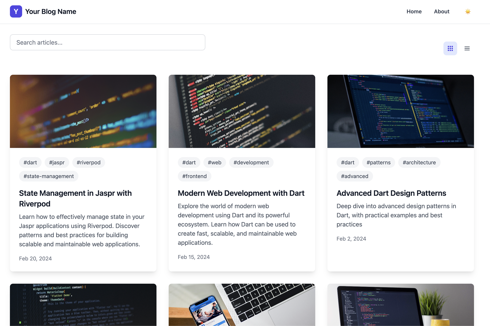
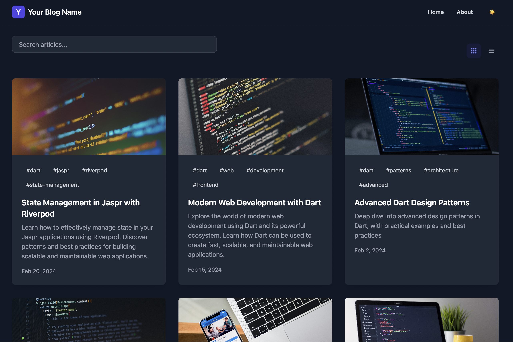
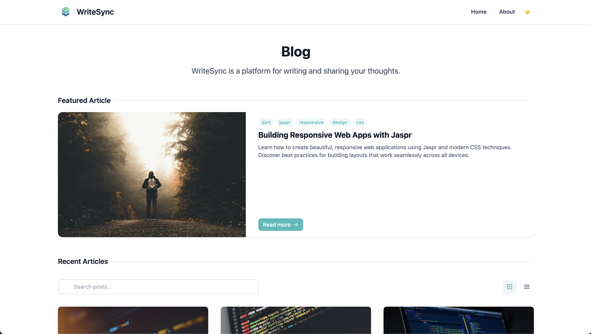
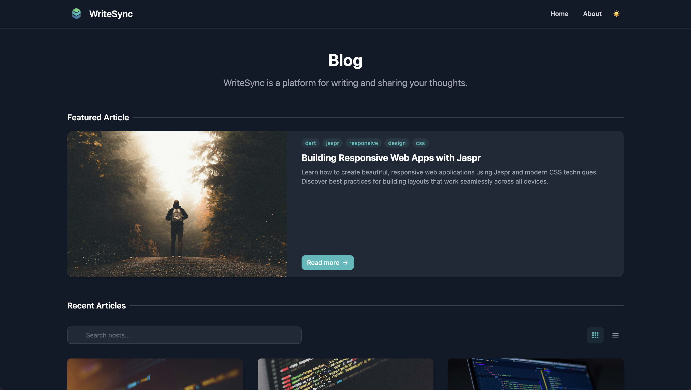
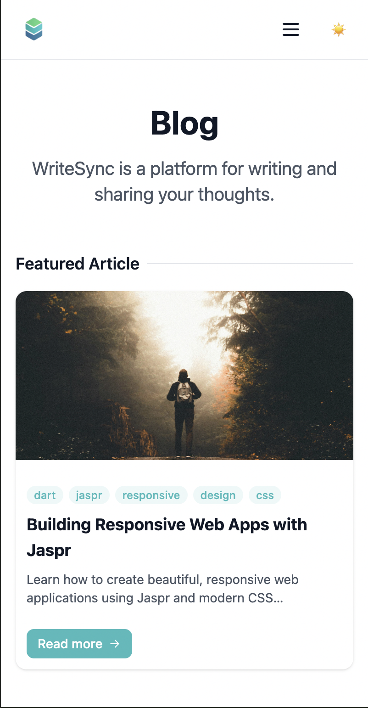
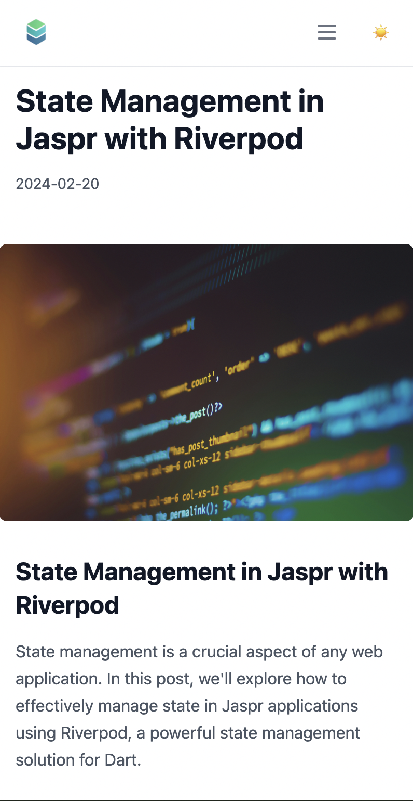
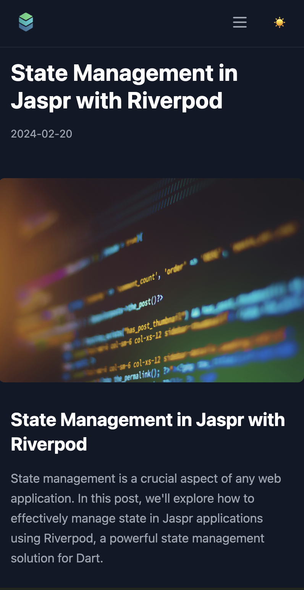
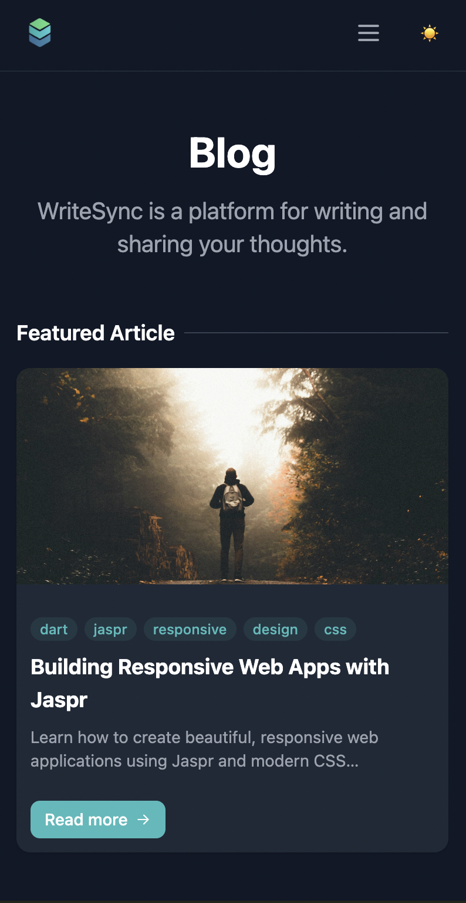

# WriteSync

<div align="center">
  

  <h1>WriteSync</h1>
  <p>A modern, responsive blog engine built with Jaspr and Dart.</p>
</div>

<div align="center">
  
  
</div>

## ✨ Features

- 🎨 **Modern Design** - Clean and minimalist UI with Tailwind CSS
- 🌓 **Dark Mode** - Seamless light/dark mode switching
- 📱 **Responsive** - Mobile-first, responsive design
- 🚀 **Server-side Rendering** - Blazing fast load times with SSR
- 📝 **Markdown Support** - Write your posts in Markdown
- 🔍 **Search** - Full-text search functionality
- 🏷️ **Tags** - Organize posts with tags
- 📊 **Smart Pagination** - Configurable pagination with multiple display options
- 🌟 **Featured Posts** - Multiple strategies for featuring posts
- 🎯 **SEO Optimized** - Dynamic meta tags and structured data
- 🔄 **Social Integration** - Easy social media sharing
- 📈 **Analytics Integration** - Built-in support for Lukehog Analytics

## 🚀 Quick Start

1. Clone this repository:
```bash
git clone https://github.com/tayormi/writesync.git
cd writesync
```

2. Install dependencies:
```bash
dart pub get
```

3. Configure plugins:
   - Visit [Lukehog](https://lukehog.com) to get your project ID
   - Update `config/plugins/lukehog_analytics.yaml`:
   ```yaml
   name: lukehog_analytics
   enabled: true
   options:
     projectId: 'your-lukehog-project-id'
     debug: false
     automaticPageviews: true
   ```

4. Run the development server:
```bash
jaspr serve
```

## 🎨 Screenshots

### Blog Layout
<div align="center">
  
  
</div>

### Main Layout
<div align="center">
  
  
</div>

### Header Design
<div align="center">
  
  
</div>

### Mobile Experience
<div align="center">
  <div style="display: flex; justify-content: center; gap: 10px;">
    
    
    
    
  </div>
  <p style="margin-top: 8px; font-style: italic; color: #666;">Responsive design optimized for mobile devices</p>
</div>

## 📊 Analytics Configuration

WriteSync comes with built-in support for Lukehog Analytics, providing seamless event tracking and user analytics.

### Features
- 🔄 Automatic page view tracking
- 🐛 Automatic error tracking
- 👤 User session management
- 📊 Event batching and retry logic
- 🎯 Configurable event filtering

### Configuration

Configure analytics in `config/plugins/lukehog_analytics.yaml`:

```yaml
name: lukehog_analytics
enabled: true
development_only: false

options:
  projectId: '${LUKEHOG_PROJECT_ID}'
  debug: false
  automaticPageviews: true
  automaticErrorTracking: true
  sessionExpiration: 1800  # 30 minutes in seconds

events:
  pageView:
    enabled: true
    properties:
      - url
      - title
      - referrer
      - deviceType
      - browserInfo

  error:
    enabled: true
    properties:
      - message
      - stackTrace
      - errorType
      - url

  interaction:
    enabled: true
    properties:
      - elementId
      - elementType
      - action
      - value

retry:
  maxAttempts: 3
  initialDelay: 1000
  maxDelay: 5000

batch:
  enabled: true
  maxSize: 10
  flushInterval: 30000

storage:
  prefix: 'lh_'
  maxItems: 1000
  maxAge: 604800
```

### Usage in Components

Track events in your components using the `MonitoringMixin`:

```dart
class MyComponent extends StatefulComponent {
  @override
  State<MyComponent> createState() => _MyComponentState();
}

class _MyComponentState extends State<MyComponent> with MonitoringMixin {
  void _handleClick() {
    trackComponentInteraction(
      'button',
      'click',
      properties: {'action': 'submit'},
    );
  }

  Future<void> _loadData() async {
    await trackOperation(
      'loadData',
      () async {
        // Your async operation here
      },
    );
  }
}
```

## 🔌 Plugin System

WriteSync features a powerful plugin system that allows you to extend functionality. Here's how to install and configure plugins:

### Installing a Plugin

1. Add the plugin to your `pubspec.yaml`:
```yaml
dependencies:
  writesync_lukehog:
    path: plugins/writesync_lukehog  # For local plugins
    # or
    git:
      url: https://github.com/yourusername/writesync-lukehog.git  # For git-hosted plugins
```

2. Create plugin configuration in `config/plugins/`:
```yaml
# config/plugins/your_plugin.yaml
name: your_plugin
enabled: true
development_only: false  # Set to true for development-only plugins

options:
  # Plugin-specific options here
  key: value
```

3. Register the plugin in your app:
```dart
import 'package:writesync_plugin/writesync_plugin.dart';

void main() {
  // Register the plugin
  final registry = context.read(pluginRegistryProvider);
  await registry.registerPlugin(YourPlugin());
  
  // Run your app
  runApp(const App());
}
```

### Plugin Types

WriteSync supports several types of plugins:

1. **Analytics Plugins**
   ```dart
   class CustomAnalyticsPlugin extends AnalyticsPlugin {
     @override
     void trackEvent(String name, {Map<String, dynamic>? properties}) {
       // Implementation
     }
   }
   ```

2. **Content Processor Plugins**
   ```dart
   class CustomProcessorPlugin extends ContentProcessorPlugin {
     @override
     Future<String> processMarkdown(String content) async {
       // Implementation
     }
   }
   ```

3. **Asset Processor Plugins**
   ```dart
   class CustomAssetPlugin extends AssetProcessorPlugin {
     @override
     Future<List<int>> processAsset(String path, List<int> content) async {
       // Implementation
     }
   }
   ```

4. **Search Plugins**
   ```dart
   class CustomSearchPlugin extends SearchPlugin {
     @override
     Future<List<String>> search(String query) async {
       // Implementation
     }
   }
   ```

### Plugin Configuration

Plugins are configured using YAML files in the `config/plugins/` directory:

1. **Main Plugin Configuration** (`config/plugins.yaml`):
```yaml
plugins:
  my_plugin:
    enabled: true
    config_path: 'plugins/my_plugin.yaml'
    options:
      key: value
```

2. **Plugin-Specific Configuration** (`config/plugins/my_plugin.yaml`):
```yaml
name: my_plugin
enabled: true
development_only: false

options:
  # Plugin-specific options here
  apiKey: 'your-api-key'
  debug: false
  customOption: 'value'
```

This configuration approach provides:
- Type-safe configuration
- Environment-aware settings
- Centralized plugin management
- Easy development/production switching
- Better security for sensitive values

### Plugin Lifecycle

Plugins follow a lifecycle that you can hook into:

```dart
class MyPlugin extends WriteSyncPlugin {
  @override
  Future<void> initialize(PluginContext context) async {
    // Called when the plugin is registered
  }

  @override
  Future<void> onBeforeBuild() async {
    // Called before the build process starts
  }

  @override
  Future<void> onAfterBuild() async {
    // Called after the build process completes
  }

  @override
  Future<void> dispose() async {
    // Called when the plugin is being disposed
  }
}
```

### Plugin Best Practices

1. **Configuration Validation**
   ```dart
   class MyPluginSchema extends PluginSchema {
     @override
     List<PluginOptionSchema> get options => [
       PluginOptionSchema(
         name: 'apiKey',
         type: String,
         required: true,
         validators: [
           PatternValidator(
             pattern: RegExp(r'^[A-Za-z0-9_-]+$'),
             message: 'Invalid API key format',
           ),
         ],
       ),
     ];
   }
   ```

2. **Error Handling**
   ```dart
   try {
     // Plugin operations
   } catch (e) {
     throw PluginException('Operation failed', e);
   }
   ```

3. **Resource Management**
   ```dart
   @override
   Future<void> dispose() async {
     // Clean up resources
     await _client?.close();
     _cache.clear();
   }
   ```

## ⚙️ Configuration

All site-wide configurations are managed in a single file: `lib/config/site_config.dart`. Here are the key configuration areas:

### Basic Configuration
```dart
class SiteConfig {
  // Site Information
  static const String siteName = 'WriteSync';
  static const String siteDescription = 'WriteSync is a platform for writing and sharing your thoughts.';
  static const String siteAuthor = 'Your Name';

  // Blog Display Configuration
  static const Map<String, bool> blogDisplay = {
    'showAuthor': false,
    'showAuthorImage': true,
    'showDate': true,
    'showTags': true,
  };
}
```

### Featured Posts Configuration
```dart
static const Map<String, dynamic> featuredPost = {
  'strategy': 'tag',     // Options: 'tag', 'latest', 'manual'
  'tag': 'featured',     // Tag to use when strategy is 'tag'
  'manualSlug': '',      // Slug to use when strategy is 'manual'
  'fallbackToLatest': true, // Use latest post if no featured post found
};
```

Featured post strategies:
- **Tag-based**: Feature posts with a specific tag
- **Manual Selection**: Feature a specific post by its slug
- **Latest Post**: Always feature the most recent post
- **Fallback**: Automatically use latest post if no featured post is found

### Pagination Configuration
```dart
// Blog Configuration
static const int postsPerPage = 6;  // Number of posts per page
static const bool enablePagination = true;
```

The pagination system:
- Excludes featured post from regular pagination
- Shows configurable number of posts per page
- Provides clear navigation between pages
- Maintains layout preference across pages

### Analytics Configuration
```dart
static const Map<String, dynamic> analytics = {
  'enabled': true,                    // Master switch for analytics
  'googleAnalytics': {
    'enabled': true,                  // GA-specific switch
    'measurementId': 'G-XXXXXXXXXX',  // Your GA4 measurement ID
    'sendPerformanceMetrics': true,   // Send Web Vitals data
    'debugMode': false,               // Enable debug logging
    'customEvents': {
      'enabled': true,                // Enable custom event tracking
      'trackPageViews': true,         // Track page views
      'trackClicks': true,            // Track user interactions
      'trackErrors': true,            // Track errors
      'trackNavigation': true,        // Track navigation events
      'trackSearch': true,            // Track search events
    },
    'customDimensions': {
      'environment': 'production',     // Custom dimensions for all events
      'version': '1.0.0',
      'theme': 'auto',
    },
  },
};
```

The analytics system provides:

1. **Web Vitals Tracking**:
   - First Contentful Paint (FCP)
   - Largest Contentful Paint (LCP)
   - First Input Delay (FID)
   - Time to Interactive (TTI)
   - Cumulative Layout Shift (CLS)

2. **Custom Event Tracking**:
   ```dart
   final monitor = context.read(performanceMonitorProvider);
   
   // Track custom events
   monitor.trackEvent(
     'button_click',
     category: 'UI',
     label: 'Submit Form',
     properties: {'form_id': 'contact'},
   );

   // Track page views
   monitor.trackPageView(
     title: 'Home Page',
     properties: {'section': 'blog'},
   );

   // Track user interactions
   monitor.trackInteraction(
     'button',
     'click',
     category: 'Navigation',
   );

   // Track search events
   monitor.trackSearch(
     'dart patterns',
     resultsCount: 5,
   );

   // Track errors
   monitor.trackError(
     'Failed to load post',
     type: 'NetworkError',
     stackTrace: stackTrace,
   );
   ```

3. **Enhanced Properties**:
   - Automatic timestamp tracking
   - Page URL and title
   - Custom dimensions
   - Environment information
   - User interaction details
   - Error tracking with stack traces

4. **Debug Mode**:
   - Console logging of all events
   - Detailed property inspection
   - Event validation
   - Performance monitoring

### Using Analytics

1. **Configuration**:
   - Update `measurementId` with your GA4 ID
   - Configure desired tracking options
   - Set custom dimensions
   - Enable/disable specific features

2. **Custom Event Tracking**:
   ```dart
   final monitor = context.read(performanceMonitorProvider);
   
   // Basic event
   monitor.trackEvent('event_name');
   
   // Event with properties
   monitor.trackEvent(
     'event_name',
     properties: {'key': 'value'},
     category: 'category',
     label: 'label',
     value: 1.0,
   );
   ```

3. **Automatic Tracking**:
   - Web Vitals metrics
   - Page views (optional)
   - User interactions (optional)
   - Error events (optional)
   - Search events (optional)

4. **Debug Mode**:
   Enable debug mode in configuration:
   ```dart
   'debugMode': true,
   ```
   This will log all events to the console with detailed information.

## 📝 Adding Blog Posts

1. Create a new markdown file in `lib/posts/` directory

2. Add front matter at the top of your markdown file:

```markdown
---
title: Your Post Title
slug: your-post-slug
date: 2024-02-25
tags: [tag1, tag2, tag3]
description: A brief description of your post
author: Your Name
image: https://url-to-your-header-image.jpg
author_image: https://url-to-your-profile-image.jpg
metadata:
  readTime: 5 min
  title: Custom SEO Title (optional)
  description: Custom SEO Description (optional)
  keywords: custom, seo, keywords (optional)
  ogImage: Custom social share image URL (optional)
---

Your post content here...
```

3. Run the build command to generate the blog post:
```bash
dart run build_runner build
```

## 🎨 Customization

### Theme Colors

Update the theme colors in `lib/config/site_config.dart`:

```dart
static const Map<String, String> colors = {
  'primary': 'indigo-600',
  'primary-light': 'indigo-400',
  'primary-dark': 'indigo-700',
};
```

### Layout

Customize layout settings:

```dart
static const Map<String, String> layout = {
  'maxWidth': 'max-w-7xl',
  'containerPadding': 'px-4 sm:px-6 lg:px-8',
  'sectionPadding': 'py-12',
  'headerHeight': 'h-16',
};
```

### Feature Flags

Enable/disable features:

```dart
static const bool enableDarkMode = true;
static const bool enableSearch = true;
static const bool enableTags = true;
static const bool enablePagination = true;
static const bool enableSocialSharing = true;
```

## 🚀 Deployment

1. Build the project:
```bash
jaspr build
```

2. The built files will be in the `build` directory. Deploy these files to your web server.

## 🔎 SEO

WriteSync comes with built-in SEO optimization:

- **Dynamic Meta Tags**: Automatically generated for each page
- **Structured Data**: JSON-LD for rich search results
- **Social Sharing**: OpenGraph and Twitter card support
- **Canonical URLs**: Proper URL handling
- **Mobile-friendly**: Responsive design for better rankings

## 🤝 Contributing

Contributions are welcome! Please feel free to submit a Pull Request.

## 📄 License

This project is licensed under the MIT License - see the LICENSE file for details.

## ⭐️ Support

If you find WriteSync helpful, please consider giving it a star ⭐️

For issues and feature requests, please use the [GitHub issue tracker](https://github.com/yourusername/jaspr-blog/issues).
