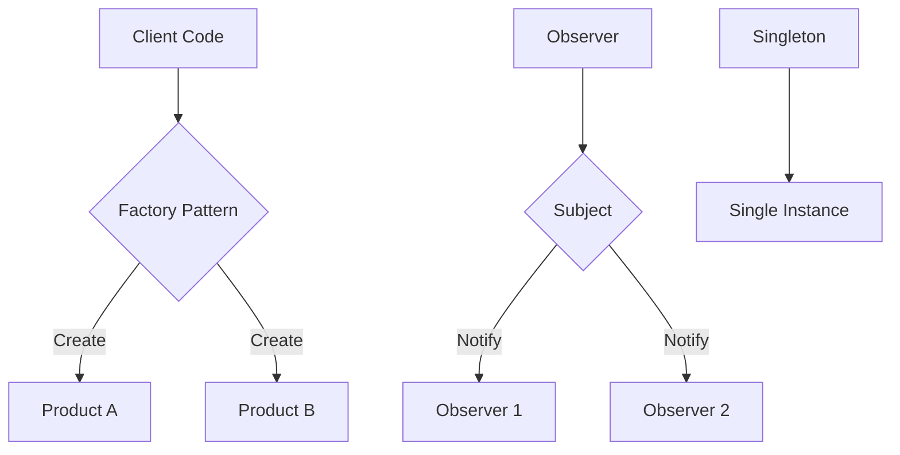

# Advanced Dart Design Patterns

Design patterns are reusable solutions to common problems in software design. Let's explore some advanced patterns in Dart.

## Factory Pattern

The Factory pattern provides an interface for creating objects without exposing the instantiation logic.

```dart
abstract class Animal {
  String makeSound();
}

class Dog implements Animal {
  @override
  String makeSound() => 'Woof!';
}

class Cat implements Animal {
  @override
  String makeSound() => 'Meow!';
}

class AnimalFactory {
  static Animal createAnimal(String type) {
    switch (type.toLowerCase()) {
      case 'dog':
        return Dog();
      case 'cat':
        return Cat();
      default:
        throw ArgumentError('Unknown animal type');
    }
  }
}
```

## Singleton Pattern

Ensure a class has only one instance and provide a global point of access to it.

```dart
class DatabaseConnection {
  static final DatabaseConnection _instance = DatabaseConnection._internal();
  
  // Private constructor
  DatabaseConnection._internal();
  
  // Factory constructor
  factory DatabaseConnection() {
    return _instance;
  }
  
  Future<void> query(String sql) async {
    // Database query implementation
  }
}
```

## Observer Pattern

Define a one-to-many dependency between objects where a state change in one object results in all its dependents being notified and updated automatically.

```dart
abstract class Subject {
  void attach(Observer observer);
  void detach(Observer observer);
  void notify();
}

abstract class Observer {
  void update(String message);
}

class NewsAgency implements Subject {
  final List<Observer> _observers = [];
  String _news = '';

  void attach(Observer observer) => _observers.add(observer);
  void detach(Observer observer) => _observers.remove(observer);
  
  void notify() {
    for (var observer in _observers) {
      observer.update(_news);
    }
  }

  set news(String value) {
    _news = value;
    notify();
  }
}

class NewsChannel implements Observer {
  final String name;
  
  NewsChannel(this.name);

  @override
  void update(String news) {
    print('$name received news: $news');
  }
}
```

## Pattern Comparison

| Pattern | Purpose | Complexity | Use Case |
|---------|---------|------------|----------|
| Factory | Object creation | Low | When object creation logic should be centralized |
| Singleton | Single instance | Low | Database connections, Configuration |
| Observer | Event handling | Medium | UI updates, Event systems |
| Builder | Complex object construction | Medium | Objects with many optional parameters |
| Strategy | Algorithm encapsulation | Medium | Different algorithms at runtime |

## Implementation Flow



## Best Practices

1. **SOLID Principles**
   ```dart
   // Single Responsibility Principle
   class UserRepository {
     final Database _db;
     
     UserRepository(this._db);
     
     Future<User> getUser(String id) async {
       // Database logic only
       return _db.query('users', id);
     }
   }
   ```

2. **Dependency Injection**
   ```dart
   class UserService {
     final UserRepository _repository;
     final AuthService _auth;
     
     UserService(this._repository, this._auth);
     
     Future<User> getCurrentUser() async {
       final userId = _auth.currentUserId;
       return _repository.getUser(userId);
     }
   }
   ```

## Performance Considerations

Here's a comparison of different pattern implementations:

| Implementation | Memory Usage | CPU Usage | Initialization Time |
|----------------|--------------|-----------|-------------------|
| Lazy Singleton | Low | Low | On-demand |
| Eager Singleton | Medium | Low | At startup |
| Factory Method | Low | Medium | Per instance |
| Abstract Factory | Medium | Medium | Per family |

## Code Organization

```
lib/
├── src/
│   ├── patterns/
│   │   ├── factory.dart
│   │   ├── singleton.dart
│   │   └── observer.dart
│   ├── models/
│   │   └── user.dart
│   └── services/
│       └── database.dart
└── main.dart
```

## Advanced Example: Combined Patterns

Here's an example combining multiple patterns:

```dart
// Singleton Service Locator with Factory Pattern
class ServiceLocator {
  static final ServiceLocator _instance = ServiceLocator._internal();
  factory ServiceLocator() => _instance;
  ServiceLocator._internal();

  final _factories = <Type, Object Function()>{};
  final _singletons = <Type, Object>{};

  void registerFactory<T>(T Function() factory) {
    _factories[T] = factory;
  }

  void registerSingleton<T>(T instance) {
    _singletons[T] = instance;
  }

  T get<T>() {
    if (_singletons.containsKey(T)) {
      return _singletons[T] as T;
    }
    
    if (_factories.containsKey(T)) {
      return _factories[T]!() as T;
    }
    
    throw Exception('No registration found for type $T');
  }
}
```

## Conclusion

Design patterns are essential tools in a developer's toolkit. Choose patterns based on your specific needs and remember that sometimes simpler solutions are better than complex patterns.

## References

1. "Design Patterns: Elements of Reusable Object-Oriented Software"
2. [Dart Design Patterns](https://dart.dev/guides/language/effective-dart)
3. [Flutter Architecture Samples](https://fluttersamples.com) 